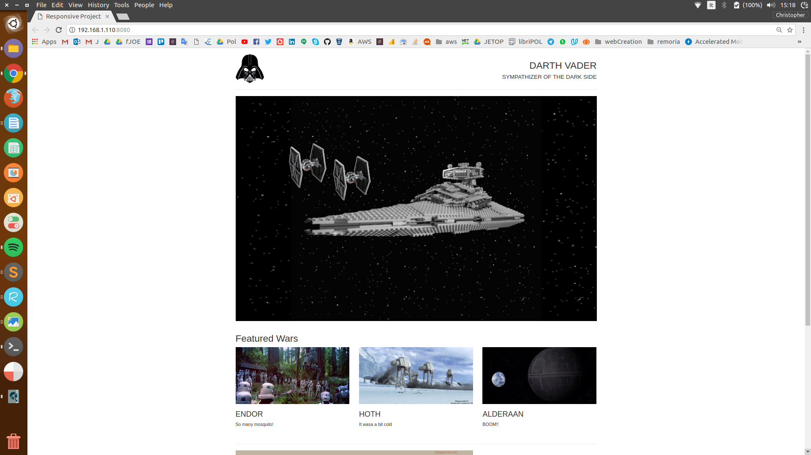

# Udacity Front-End Web Developer Nanodegree Project

 

 

This is one of the projects avaible on the [Udacity Front-End Web Developer Nanodegree.](https://www.udacity.com/course/front-end-web-developer-nanodegree--nd001) 

 

### Project instructions:
1. Create a single page website using [Bootstrap](http://getbootstrap.com/) following the guide lines provided from a mockup.
The content of the website was at the student choice.

2. (Not requested) Use of [grunt](https://gruntjs.com/) to automatize the process of detecting changes in the code, combine files together and compress them.
 
 
 

If you would like to see a running website I developed using Bootsrapt please visit the [Remoria website](http://remoria.io).

